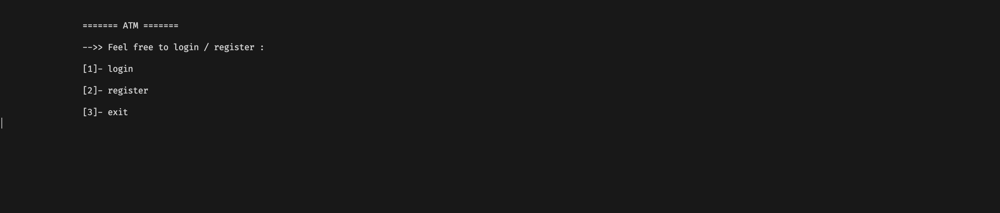
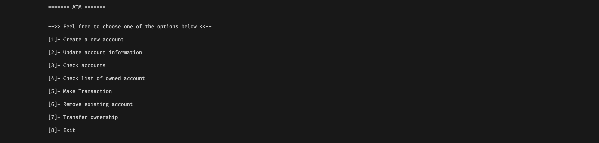
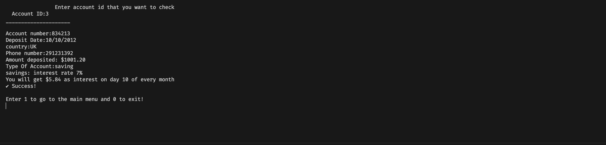
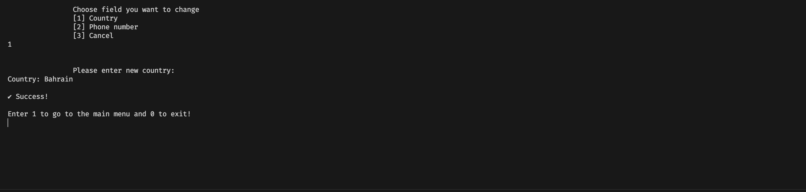
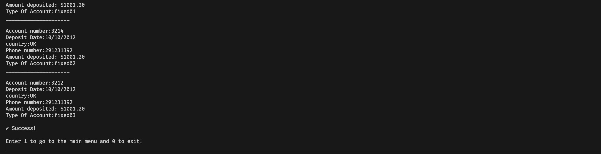
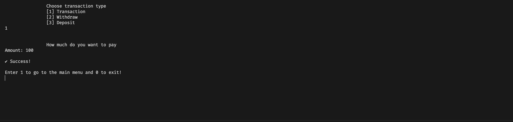

# atm management system

this is a file based ATM simulator written in the C programming language
it has many features:
- User account with passwords
- update account information
- bank accounts
- update bank account details
- withdraw and deposit
- delete account
- transfer account ownership

to run it you will need to run the following commands
\
```bash
make
./atm
```

Login Screen


Main Screen


Check bank account details


Update bank account details


Check all accounts summary


Making a transaction
